# GitHub Copilot 0.10.0 Release Notes
### Custom Instructions Now Supported in Copilot
You can now use custom instructions to provide Copilot with additional context tailored to your work. This helps Copilot deliver more relevant and personalized assistance.

Check for [more details](https://docs.github.com/en/copilot/how-tos/configure-custom-instructions/add-repository-instructions).

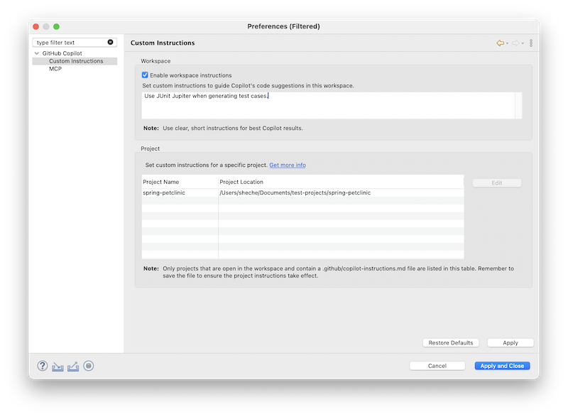

---

### Image Support in Chat Context
You can now add images directly to the chat context. Check below example how Copilot interpret a hand-drawn layout page, and generate corresponding HTML code:

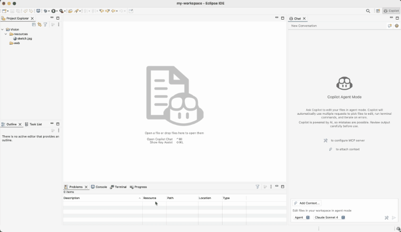

Note: Some models do not support vision capabilities. In such cases, a warning will be displayed.

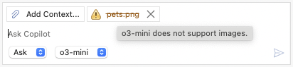

---

### Folders Can Now Be Added to Chat Context
In addition to images, you can now attach entire folders to enrich the chat context. This makes it easier to share structured content and collaborate more effectively.

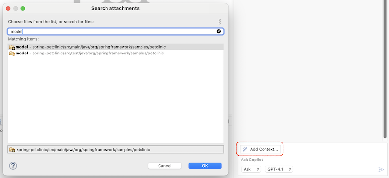

---

### MCP Support Enhancements in Copilot
Copilot now includes several enhancements for MCP support:

#### GitHub MCP Server OAuth Integration
You can now configure your GitHub MCP server using OAuth. Here's a sample configuration:

```javascript
{
  "servers": {
    "github": {
      "type": "http",
      "url": "https://api.githubcopilot.com/mcp/"
    }
  }
}
```

#### MCP Feature Flag Support
The Copilot plugin will automatically disable MCP features if it is turned off in the Copilot portal: https://github.com/settings/copilot/features, ensuring better alignment with your configuration settings.

---

### Improved UX for Starting New Conversations in Agent Mode
When creating a new conversation in agent mode, a confirmation dialog will now appear if there are any unhandled files in the current context. This helps prevent accidental data loss and ensures you don’t lose important changes unexpectedly.

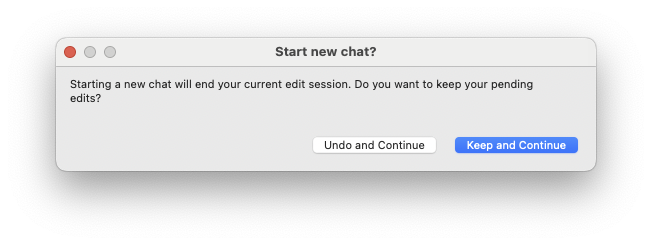

---

### Chat View Banner Enhancements
The top banner in the chat view has been improved to enhance usability. It now displays the conversation title and includes a convenient Edit Preferences... shortcut button.

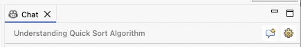

---

# GitHub Copilot 0.9.0 Release Notes
### GitHub Copilot Now Supports Eclipse 2024-03 & 2024-06!
We’re thrilled to announce that GitHub Copilot is now fully compatible with **Eclipse 2024-03** and **2024-06**! Whether you're coding in the latest release or just upgraded, you can now enjoy the full power of Copilot’s AI assistance right inside your Eclipse IDE.

---

### One-Click Commit Messages Generation with Copilot
You can now automatically generate meaningful Git commit messages with a single click. Just head to the **Git Staging** view and hit the **Generate Commit Message With Copilot** button in the toolbar. Copilot will analyze your staged changes and suggest a clear, concise message.

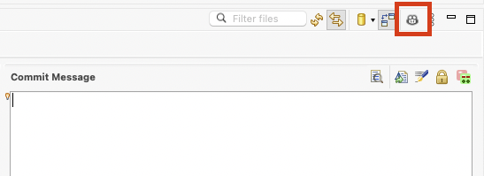

---

### Making Chat An Expert with @workspace Context
You can now supercharge your prompts in **Ask Mode** using the new @workspace context!

To enable it:

1. Head to GitHub Copilot Preferences
2. Check the box for Enable workspace context

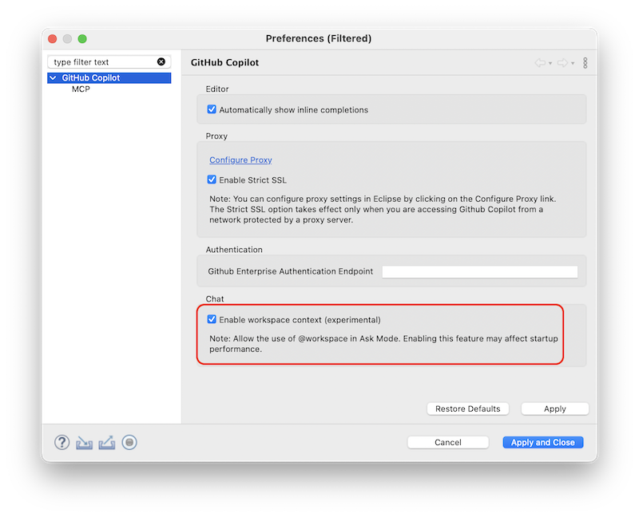

Once enabled, Copilot can understand and respond based on your entire codebase—just use **@workspace** in your questions.

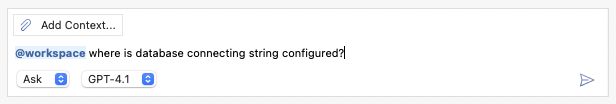

---

### Dive into MCP Logs in Console View
You can now view **detailed logs** from your configured MCP servers directly in the Console View. Just toggle to **Copilot (MCP)** and explore the insights.

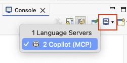

---

### A Smoother Start: Revamped Getting Started Experience

We’ve reimagined the onboarding journey to make it easier than ever to get started with GitHub Copilot in Eclipse:

1. **Quickstart Guide**: A step-by-step walkthrough to get you up and running.

   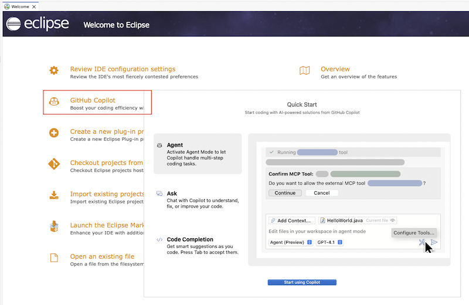
2. **Dedicated Perspective**: A new layout tailored for Copilot workflows. To enable the **Copilot** perspective, go to **Window** > **Perspective** > **Open Perspective** > **Other...** > **Copilot**

   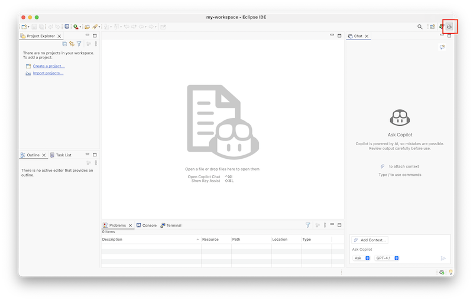
3. **Refined Chat View**: The Copilot Chat interface has been polished with a cleaner layout and a more intuitive default placement across commonly used Eclipse perspectives.

---

### Bug Fixes & Improvements
This release also includes bug fixes and enhancements to improve overall stability and user experience.

---

# GitHub Copilot 0.8.0 Release Notes

### Remote MCP Server support
Now user can configure remote MCP server in the MCP preference page, below is an example of remote GitHub MCP Server with PAT:

```javascript
{
  "servers": {
    "github": {
      "url": "https://api.githubcopilot.com/mcp/",
      "requestInit": {
        "headers": {
          "Authorization": "Bearer <yourToken>"
        }
      }
    }
  }
}
```

_Note: OAuth authorization is not supported right now._

### Bug Fixes & Improvements
This release also includes bug fixes and enhancements to improve overall stability and user experience.
